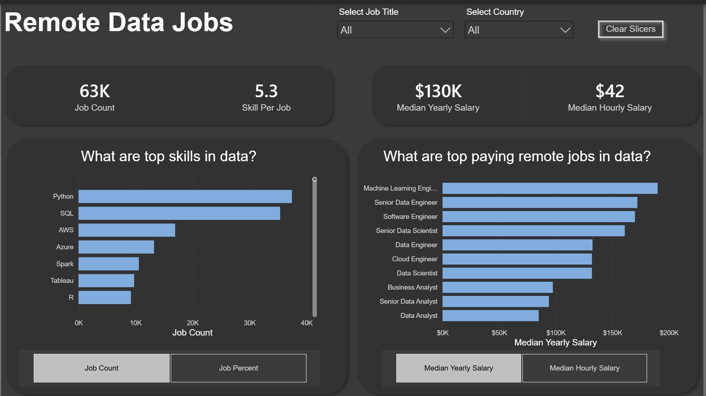
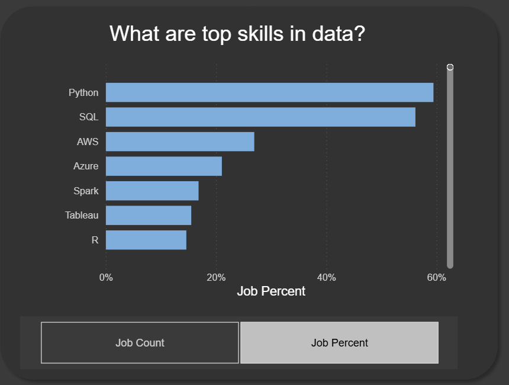
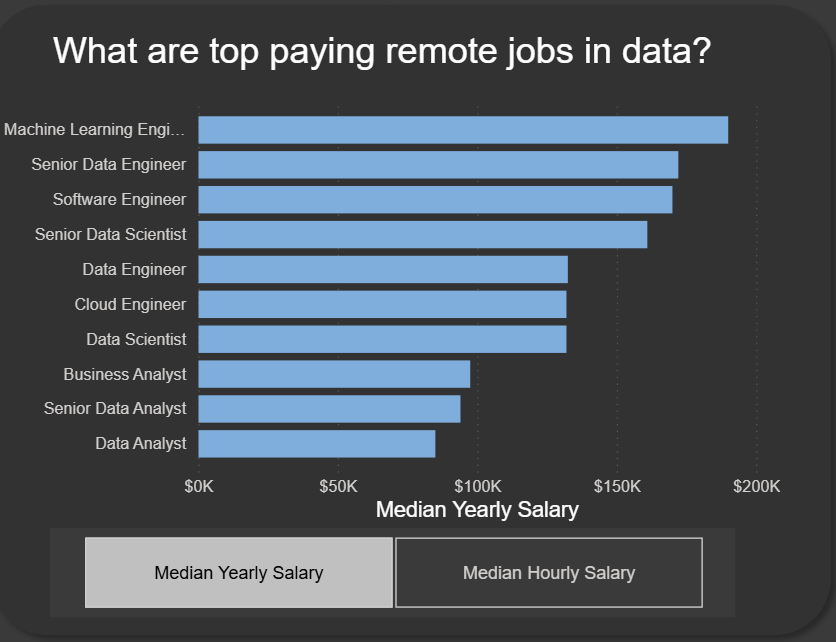
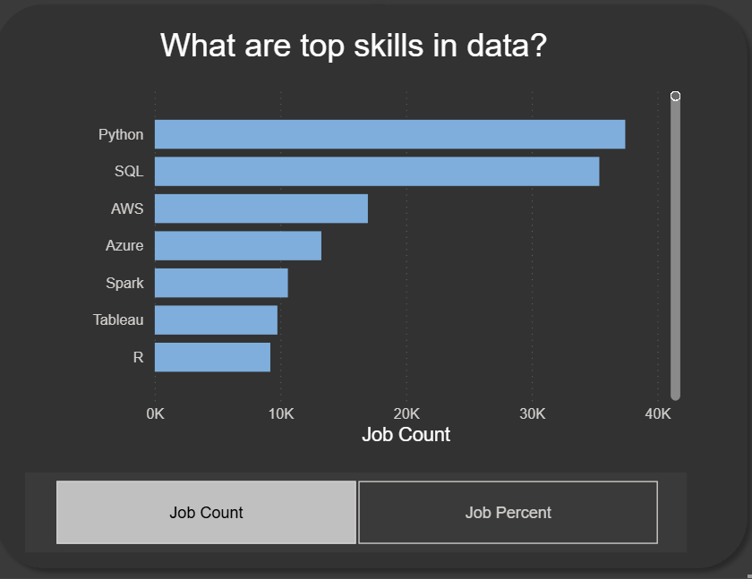

# Remote Data Jobs — Hiring Market Analysis


## Executive Summary

The remote data-job market has become increasingly diverse, with opportunities ranging from traditional data analytics and business intelligence to data science, data engineering, cloud engineering, and machine learning.

But for someone trying to understand this market, simply knowing that "data jobs are available" doesn't tell the whole story.

**Which skills are employers actually asking for? Which roles command the strongest compensation? And what does this tell us about the different career paths within the data industry?**

This project analyzes approximately **63K remote data-job postings** to explore those questions.

At a high level, the data points us toward an interesting relationship between **foundational skills, technical specialization, and compensation**.

We can see that the median yearly salary across the analyzed dataset is approximately **$130K**, while the median hourly salary is approximately **$42**. The typical job posting contains around **5.3 skills**, suggesting that employers are generally looking for combinations of capabilities rather than a single isolated skill.

As we move deeper into the analysis, however, the market becomes more differentiated.

**Python and SQL emerge as the strongest foundational skills, while cloud technologies such as AWS and Azure appear prominently alongside technologies such as Spark, Tableau, and R.**

At the same time, the highest-paying positions shown in the dashboard are concentrated among more specialized technical roles, particularly **Machine Learning Engineering, Data Engineering, Cloud Engineering, and Data Science**.

This creates an important story:

> **The remote data market rewards strong foundations, but specialization increasingly separates different career paths and compensation levels.**

The dashboard allows users to explore this story interactively by **job title and country**, moving from a broad view of the market toward more specific questions about individual roles and geographic markets.

---

# 1. Business Context

The remote data-job market contains a wide range of positions with substantially different skill requirements and compensation levels.

For someone entering the data field, simply knowing that "data jobs are in demand" is not enough.

A more useful set of questions is:

- Which skills are most frequently requested?
- Which roles offer the strongest compensation?
- How different are analyst roles from engineering and machine-learning roles?
- Which technologies appear across the broader data ecosystem?
- How does the market change when we look at different countries?

This project approaches the dataset from a **job-market and career-planning perspective**.

The analysis can be useful for several stakeholders:

### Aspiring Data Professionals

The analysis can help professionals identify:

- Commonly requested technical skills
- Potential career paths
- Differences between data roles
- Compensation patterns
- Skills worth prioritizing

### Employers and Hiring Teams

The analysis can provide a high-level view of:

- Skill demand
- Compensation differences
- Role specialization
- The broader remote data talent market

### Career Planners

The analysis can help compare different directions within the data ecosystem and understand how foundational skills can lead toward different specializations.

---

# 2. The Questions Behind the Analysis

Rather than beginning with individual charts, the analysis was structured around several business questions.

### Question 1

**What skills are employers looking for across remote data jobs?**

### Question 2

**Which data-related roles have the highest median compensation?**

### Question 3

**How does compensation change as roles become more specialized?**

### Question 4

**What relationship can we observe between foundational skills and specialized technical skills?**

### Question 5

**How does the remote data-job market change when we filter by job title and country?**

These questions provide the framework for the dashboard and help move the analysis beyond simply presenting descriptive statistics.

---

# 3. Understanding the Size of the Market

Before looking at individual skills or salaries, it is useful to establish the overall scale of the dataset.

The dashboard contains approximately:

### **63K**
Remote Data Job Postings

Each posting contains approximately:

### **5.3**
Skills Per Job

This is an important starting point.

If the average job posting contains multiple skills, employers are generally not searching for candidates with one isolated technical capability.

Instead, they are looking for **combinations of skills** that support the responsibilities of a particular role.

This leads to a more useful question:

> **What combination of skills helps candidates position themselves for different parts of the market?**

The remainder of the analysis explores that question through skill demand, compensation, and role specialization.

---

# 4. What Skills Are Employers Looking For?


When we look at the most frequently requested skills, the first pattern becomes difficult to miss.

**Python and SQL clearly lead the market.**

Behind them, we see:

- AWS
- Azure
- Spark
- Tableau
- R

The ordering provides an interesting view of the skill landscape.

At the top are technologies that can function as broad analytical foundations.

Further down, we begin to see technologies associated with cloud infrastructure, large-scale data processing, visualization, and statistical analysis.

This creates a useful distinction between **foundational analytical skills** and **specialized technical capabilities**.

---

## 4.1 Foundational Skills

### SQL

SQL provides the ability to query, transform, join, filter, and analyze structured data.

For many data roles, SQL represents one of the fundamental ways professionals interact with organizational data.

### Python

Python extends analytical capabilities into areas such as:

- Data manipulation
- Automation
- Statistical analysis
- Advanced analytics
- Machine learning

The fact that Python and SQL occupy the top positions in the skill-demand visualization suggests that these technologies form an important foundation across the broader data ecosystem.

---

## 4.2 Specialized Technical Skills

The dashboard also highlights technologies such as:

- AWS
- Azure
- Spark
- Tableau
- R

These skills begin to point toward different areas of specialization.

AWS and Azure indicate the importance of cloud environments.

Spark points toward large-scale data processing.

Tableau focuses heavily on visualization and business intelligence.

R provides another environment for statistical analysis and data science.

The broader story is therefore more interesting than simply saying that Python is the "most popular" skill.

> **The market appears to be built around a common analytical foundation, with additional technologies creating pathways into specialization.**

For someone entering the field, this distinction matters.

The objective should not necessarily be to learn every technology shown in the dashboard.

Instead, professionals can build a strong foundation and then develop the technologies most relevant to their target career.

---

# 5. Where Does Compensation Begin to Diverge?



Now we move from **skill demand** to **compensation**.

This is where the story changes.

The dashboard shows a median yearly salary of approximately:

### **$130K**

and a median hourly salary of approximately:

### **$42**

However, the overall median hides significant differences between individual roles.

When we break compensation down by job title, the market becomes much more differentiated.

The highest-paying roles displayed in the dashboard include:

1. Machine Learning Engineer
2. Senior Data Engineer
3. Software Engineer
4. Senior Data Scientist
5. Data Engineer
6. Cloud Engineer
7. Data Scientist
8. Business Analyst
9. Senior Data Analyst
10. Data Analyst

This tells us something important:

> **"Data" is not one homogeneous career category.**

Two professionals may both work with data every day while operating in very different parts of the labor market.

---

# 6. Understanding the Role Differences

A Data Analyst may primarily focus on:

- Querying data
- Reporting
- Dashboards
- Business insights
- Performance analysis

A Data Engineer may focus more heavily on:

- Data pipelines
- Data infrastructure
- Data processing
- Data architecture

A Data Scientist may work on:

- Statistical analysis
- Predictive modeling
- Experimentation
- Machine learning

A Machine Learning Engineer may work on:

- Machine learning systems
- Model deployment
- Production environments
- Engineering infrastructure

Although all of these professionals work with data, the technical depth and responsibilities can be substantially different.

This helps explain why compensation varies so significantly between the roles displayed in the dashboard.

The difference is not simply about whether someone "works with data."

It reflects differences in:

- Technical specialization
- Responsibilities
- Engineering complexity
- Experience
- Domain knowledge
- Business impact

---

# 7. The Relationship Between Skills and Compensation



This is where the analysis becomes particularly useful.

If we look at the **skills chart** and **compensation chart** together, we can see two different layers of the market.

At the foundation are skills such as:

**SQL → Python → Data Visualization**

These provide a pathway into analytical roles.

As we move toward more specialized capabilities:

**Cloud → Data Engineering → Machine Learning**

we begin to see career paths associated with some of the highest-paying positions displayed in the dashboard.

This does **not** mean that learning a specific technology automatically produces a higher salary.

Instead, the data suggests that these technologies are often part of roles that require a greater degree of technical specialization.

That distinction is important.

> **The technology itself isn't necessarily what creates the compensation difference; the role, responsibilities, specialization, and experience surrounding that technology are critical.**

---

# 8. What Does This Mean for Someone Entering Data Analytics?

If we approach the dashboard from a career-planning perspective, the findings provide a fairly clear direction.

There is little reason for a beginner to attempt to master every technology represented in the dataset simultaneously.

Instead, the market suggests a progression.

---

## 8.1 Build the Foundation

A practical analytical foundation can include:

**SQL + Excel + Power BI + Python**

These skills provide the ability to:

- Retrieve and manipulate data
- Analyze datasets
- Build dashboards
- Communicate findings
- Automate analytical tasks
- Develop a foundation for more advanced work

---

## 8.2 Choose a Direction

Once the foundation is established, professionals can specialize according to the type of work they want to perform.

### Analytics Path

**SQL + Excel + Power BI**

↓

**Data Analyst**

↓

**Senior Data Analyst**

↓

**BI / Analytics Roles**

---

### Data Engineering Path

**SQL + Python + Cloud**

↓

**Data Engineer**

↓

**Senior Data Engineer**

---

### Data Science Path

**SQL + Python + Statistics**

↓

**Data Scientist**

↓

**Machine Learning / Advanced Analytics**

---

The important point is that the foundation can be shared while the specialization changes.

This makes career planning more deliberate.

Rather than asking:

> "What technology should I learn next?"

a better question becomes:

> **"What role am I trying to become qualified for, and which skills support that role?"**

---

# 9. Geographic Perspective

The dashboard also includes a **Country** filter.

This allows the analysis to move beyond the overall remote-job market and investigate how the results change geographically.

This is particularly important when analyzing remote employment.

A position being labeled **"remote"** does not necessarily mean that it is available to candidates in every country.

Companies may restrict hiring based on factors such as:

- Employment regulations
- Payroll infrastructure
- Tax requirements
- Time zones
- Data-security considerations
- Country-specific hiring policies

Therefore, country-level analysis provides another layer of context when interpreting remote job opportunities.

The country filter allows users to investigate whether the patterns observed at the overall market level remain consistent when examining individual markets.

---

# 10. Key Insights

After moving from job volume → skills → compensation → specialization, several major insights emerge.

---

## Insight 01 — Strong Foundations Remain Critical

Python and SQL dominate the skill-demand visualization.

This suggests that foundational analytical and programming capabilities remain highly relevant across the remote data-job market.

For professionals entering the industry, these skills provide a strong starting point before moving into more specialized areas.

---

## Insight 02 — The Market Rewards Specialization

The highest-paying roles displayed in the dashboard are concentrated among technically specialized positions.

Machine Learning Engineering, Data Engineering, Cloud Engineering, and Data Science appear toward the higher end of the compensation ranking.

This suggests that career progression isn't simply about collecting more tools.

It is about developing **deeper capabilities around a particular type of problem.**

---

## Insight 03 — The Data Industry Contains Multiple Labor Markets

Data Analyst, Business Analyst, Data Scientist, Data Engineer, Cloud Engineer, and Machine Learning Engineer may all belong to the broader data ecosystem.

However, they represent different labor markets.

Each role comes with different:

- Skill requirements
- Responsibilities
- Technical depth
- Compensation levels
- Career trajectories

Understanding this distinction is important for anyone trying to enter or progress within the industry.

---

## Insight 04 — Remote Does Not Mean Location-Independent

The presence of a remote label should not automatically be interpreted as "work from anywhere."

Geographic restrictions can still influence eligibility.

The country filter therefore adds an important layer to the analysis by allowing the market to be examined from a geographic perspective.

---

# 11. Recommendations

The findings lead to several practical recommendations.

---

## Recommendation 01 — Build Strong Foundations First

For professionals entering data analytics, the first priority should be developing strong analytical fundamentals.

A practical starting point is:

**SQL + Excel + Power BI + Python**

These skills provide a flexible foundation that can support multiple career paths.

---

## Recommendation 02 — Specialize After Building the Foundation

Once the fundamentals are established, professionals should choose a direction based on the work they want to perform.

For example:

**Business-facing analytics**

→ Power BI  
→ Business Intelligence  
→ Analytics

**Technical data infrastructure**

→ Python  
→ Cloud  
→ Data Engineering

**Advanced analytical modeling**

→ Python  
→ Statistics  
→ Machine Learning

This approach is more sustainable than trying to learn every technology simultaneously.

---

## Recommendation 03 — Develop Cloud Awareness

AWS and Azure appear among the leading skills in the dashboard.

Professionals interested in expanding beyond traditional analytics should therefore consider developing foundational cloud knowledge.

Cloud technologies can provide a bridge between analytics and more technical data roles.

---

## Recommendation 04 — Evaluate Compensation at the Role Level

The differences between job titles demonstrate why a single "average data salary" can be misleading.

Compensation should be evaluated according to:

- Job title
- Seniority
- Technical specialization
- Industry
- Location
- Experience

This produces a more meaningful view of the labor market.

---

# 12. Dashboard

The Power BI dashboard was designed as an interactive analytical tool rather than a collection of static charts.

Users can filter the analysis using:

### Job Title

Explore differences between individual data-related roles.

### Country

Investigate how job-market patterns change geographically.

---

## Dashboard KPIs

| KPI | Value |
|---|---:|
| Job Count | 63K |
| Skills Per Job | 5.3 |
| Median Yearly Salary | $130K |
| Median Hourly Salary | $42 |

These metrics establish the overall market before users move into the detailed visualizations.

---

# 13. Skill Demand Analysis

The skills visualization ranks the most frequently requested technical skills in the analyzed remote data jobs.

The dashboard highlights:

1. Python
2. SQL
3. AWS
4. Azure
5. Spark
6. Tableau
7. R

The visualization can be switched between:

- **Job Count**
- **Job Percentage**

This allows users to examine skill demand from two perspectives.

### Job Count

Shows the absolute number of job postings associated with each skill.

### Job Percentage

Provides a relative view of skill frequency within the analyzed job market.

---

# 14. Compensation Analysis

The compensation visualization compares median compensation across data-related job titles.

Users can switch between:

- **Median Yearly Salary**
- **Median Hourly Salary**

This makes it possible to evaluate compensation using both annual and hourly measures.

The visualization highlights a clear difference between traditional analytics roles and more technically specialized positions.

---

# 15. Analytical Approach

The project follows a business-oriented analytical workflow:

```text
Raw Data
   ↓
Data Preparation
   ↓
Data Modeling
   ↓
DAX Measures
   ↓
Dashboard Development
   ↓
Exploratory Analysis
   ↓
Business Insights
   ↓
Recommendations
```
# 16. Tools & Technologies

- **SQL / PostgreSQL** — Data exploration, joins, aggregation, filtering, and analysis
- **Power BI** — Interactive dashboard development and data visualization
- **DAX** — KPI and analytical measure development
- **Excel** — Data exploration and preparation
- **Git / GitHub** — Version control and project documentation

---

# 17. Project Structure

```text
Remote-Data-Hiring-Market-Analysis/
│
├── README.md
├── Remote_data_jobs.png
├── top_data_skills.png
├── top_paying_remote_jobs.png
├── top_paying_skills_job_count.png
│
└── sql_analysis/
    ├── 1_top_paying_jobs.sql
    ├── 2_top_paying_job_skills.sql
    ├── 3_top_demanded_skills.sql
    ├── 4_top_paying_skills.sql
    └── 5_optimal_skills.sql


